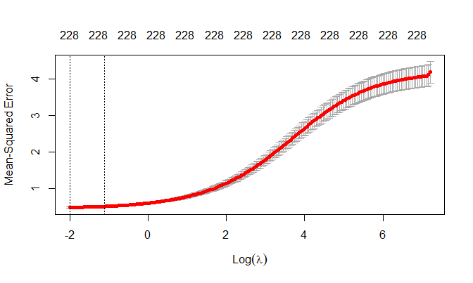
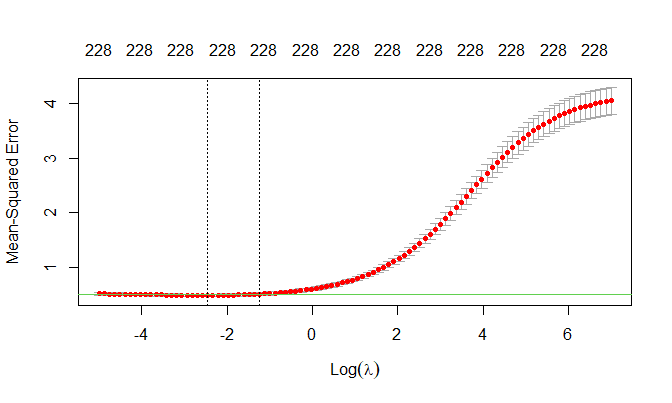
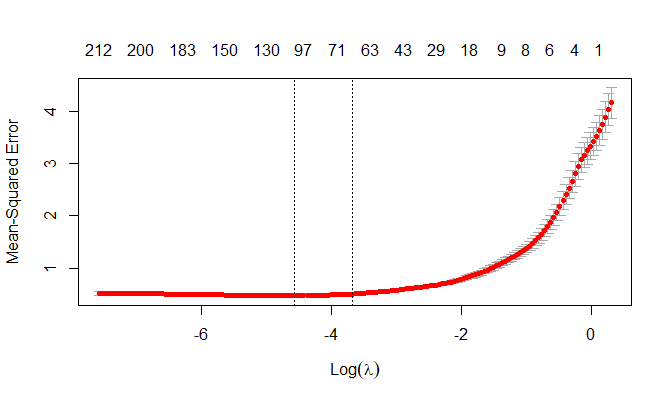
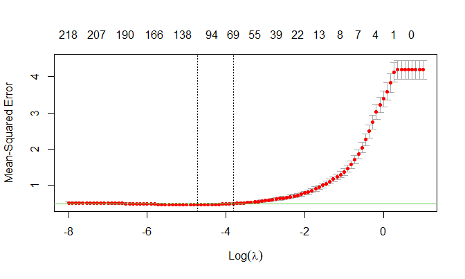

Homework \#1
================
David Nemirovsky
2/14/21

In this exercise, we will predict solubility of compounds using their
chemical structures. The training data are in the file
“solubility\_train.csv” and the test data are in
“solubility\_test.csv”. Among the 228 predictors, 208 are binary
variables that indicate the presence or absence of a particular chemical
substructure, 16 are count features, such as the number of bonds or the
number of bromine atoms, and 4 are continuous features, such as
molecular weight or surface area. The response is in the column
“Solubility” (the last column).

1)  Fit a linear model using least squares on the training data and
    calculate the mean squared error using the test data.

<!-- end list -->

  - First, let’s read in the data:

<!-- end list -->

``` r
train_df = read_csv("solubility_train.csv")
test_df = read_csv("solubility_test.csv")
```

  - Next, let’s create a linear model with 10-fold CV:

<!-- end list -->

``` r
set.seed(37564)
ctrl = trainControl(method = "cv", number = 10)
model_lm = train(Solubility~., 
               data = train_df, 
               method = "lm", 
               trControl = ctrl)

model_lm$finalModel$coefficients %>% 
  broom::tidy() %>% 
  knitr::kable(col.names = c("Predictor", "Beta Value"))
```

| Predictor         |   Beta Value |
| :---------------- | -----------: |
| (Intercept)       |    2.4307073 |
| FP001             |    0.3593637 |
| FP002             |    0.1455962 |
| FP003             |  \-0.0396932 |
| FP004             |  \-0.3048941 |
| FP005             |    2.8367245 |
| FP006             |  \-0.0688605 |
| FP007             |    0.0404391 |
| FP008             |    0.1121160 |
| FP009             |  \-0.8242261 |
| FP010             |    0.4193129 |
| FP011             |    0.0515819 |
| FP012             |  \-0.0134551 |
| FP013             |  \-0.4518555 |
| FP014             |    0.3281228 |
| FP015             |  \-0.1839154 |
| FP016             |  \-0.1367002 |
| FP017             |  \-0.1704358 |
| FP018             |  \-0.3824335 |
| FP019             |  \-0.3131000 |
| FP020             |    0.2071759 |
| FP021             |  \-0.0595630 |
| FP022             |    0.2336336 |
| FP023             |  \-0.3193254 |
| FP024             |  \-0.4272191 |
| FP025             |    0.4376374 |
| FP026             |    0.2067680 |
| FP027             |    0.2423901 |
| FP028             |    0.1070430 |
| FP029             |  \-0.0985727 |
| FP030             |  \-0.2361162 |
| FP031             |    0.0869040 |
| FP032             |  \-1.2044863 |
| FP033             |    0.5766339 |
| FP034             |  \-0.1793970 |
| FP035             |  \-0.2139666 |
| FP036             |    0.0770144 |
| FP037             |    0.1097876 |
| FP038             |    0.2721086 |
| FP039             |    0.0201134 |
| FP040             |    0.5477244 |
| FP041             |  \-0.4265237 |
| FP042             |  \-0.9900896 |
| FP043             |  \-0.0372482 |
| FP044             |  \-0.3859623 |
| FP045             |    0.2119504 |
| FP046             |  \-0.0350450 |
| FP047             |  \-0.0167462 |
| FP048             |    0.2610329 |
| FP049             |    0.1241333 |
| FP050             |    0.0090865 |
| FP051             |    0.1050135 |
| FP052             |  \-0.4569080 |
| FP053             |    0.2994138 |
| FP054             |    0.0273424 |
| FP055             |  \-0.3661526 |
| FP056             |  \-0.2961311 |
| FP057             |  \-0.1002038 |
| FP058             |    0.3100159 |
| FP059             |  \-0.1614836 |
| FP060             |    0.2350486 |
| FP061             |  \-0.6365304 |
| FP062             |  \-0.5224157 |
| FP063             |  \-2.0009445 |
| FP064             |    0.2549351 |
| FP065             |  \-0.2844497 |
| FP066             |    0.2092773 |
| FP067             |  \-0.1406065 |
| FP068             |    0.4964047 |
| FP069             |    0.1324178 |
| FP070             |    0.0034526 |
| FP071             |    0.1473905 |
| FP072             |  \-0.9773384 |
| FP073             |  \-0.4671401 |
| FP074             |    0.1792652 |
| FP075             |    0.1230577 |
| FP076             |    0.5165583 |
| FP077             |    0.1643990 |
| FP078             |  \-0.3714665 |
| FP079             |    0.4254428 |
| FP080             |    0.3100544 |
| FP081             |  \-0.3207553 |
| FP082             |    0.1242727 |
| FP083             |  \-0.6916390 |
| FP084             |    0.3626367 |
| FP085             |  \-0.3309658 |
| FP086             |    0.0116900 |
| FP087             |    0.0455920 |
| FP088             |    0.2415558 |
| FP089             |    0.5999370 |
| FP090             |  \-0.0245036 |
| FP091             |  \-0.2857602 |
| FP092             |    0.2665497 |
| FP093             |    0.1974210 |
| FP094             |  \-0.1990652 |
| FP095             |  \-0.1402989 |
| FP096             |  \-0.5024174 |
| FP097             |  \-0.2635359 |
| FP098             |  \-0.2864536 |
| FP099             |    0.2591782 |
| FP100             |  \-0.4007991 |
| FP101             |  \-0.1759932 |
| FP102             |    0.2445464 |
| FP103             |  \-0.1492643 |
| FP104             |  \-0.1427685 |
| FP105             |  \-0.0691176 |
| FP106             |    0.1127634 |
| FP107             |    2.7779666 |
| FP108             |    0.0088356 |
| FP109             |    0.8199741 |
| FP110             |    0.3679643 |
| FP111             |  \-0.5564779 |
| FP112             |  \-0.1078868 |
| FP113             |    0.1510756 |
| FP114             |  \-0.1200949 |
| FP115             |  \-0.1895825 |
| FP116             |    0.0077783 |
| FP117             |    0.2582847 |
| FP118             |  \-0.1963735 |
| FP119             |    0.7514679 |
| FP120             |  \-0.1813515 |
| FP121             |  \-0.0473144 |
| FP122             |    0.1047909 |
| FP123             |    0.0392621 |
| FP124             |    0.1234651 |
| FP125             |  \-0.0002633 |
| FP126             |  \-0.2781620 |
| FP127             |  \-0.6122520 |
| FP128             |  \-0.5424304 |
| FP129             |  \-0.0673123 |
| FP130             |  \-1.0339635 |
| FP131             |    0.2158071 |
| FP132             |  \-0.1976246 |
| FP133             |  \-0.1573500 |
| FP134             |    2.4960171 |
| FP135             |    0.1817864 |
| FP136             |  \-0.0776324 |
| FP137             |  \-0.0461261 |
| FP138             |  \-0.0939216 |
| FP139             |    0.0765908 |
| FP140             |    0.3145386 |
| FP141             |    0.2219191 |
| FP142             |    0.6271871 |
| FP143             |    0.9981011 |
| FP144             |    0.2206593 |
| FP145             |  \-0.1145723 |
| FP146             |  \-0.2323552 |
| FP147             |    0.1501710 |
| FP148             |  \-0.1600227 |
| FP149             |    0.1172060 |
| FP150             |    0.0904610 |
| FP151             |    0.2898761 |
| FP152             |  \-0.2543950 |
| FP153             |  \-0.3764599 |
| FP154             |  \-1.0271716 |
| FP155             |    0.4887988 |
| FP156             |  \-0.0360217 |
| FP157             |  \-0.4714552 |
| FP158             |    0.0166913 |
| FP159             |    0.1800243 |
| FP160             |    0.0152547 |
| FP161             |  \-0.2439620 |
| FP162             |    0.0491043 |
| FP163             |    0.4785031 |
| FP164             |    0.5096481 |
| FP165             |    0.5793388 |
| FP166             |  \-0.0658208 |
| FP167             |  \-0.6043747 |
| FP168             |  \-0.1187060 |
| FP169             |  \-0.1704501 |
| FP170             |  \-0.0790151 |
| FP171             |    0.4651390 |
| FP172             |  \-0.4425755 |
| FP173             |    0.4243419 |
| FP174             |  \-0.1010089 |
| FP175             |  \-0.0465741 |
| FP176             |    0.9736304 |
| FP177             |    0.1386190 |
| FP178             |    0.0649749 |
| FP179             |  \-0.0341457 |
| FP180             |  \-0.7904560 |
| FP181             |    0.4925405 |
| FP182             |  \-0.1123825 |
| FP183             |    0.2997852 |
| FP184             |    0.4875761 |
| FP185             |  \-0.3777906 |
| FP186             |  \-0.3654254 |
| FP187             |    0.4457250 |
| FP188             |    0.1475076 |
| FP189             |  \-0.0198448 |
| FP190             |    0.2628656 |
| FP191             |    0.2799151 |
| FP192             |  \-0.2404048 |
| FP193             |    0.1501758 |
| FP194             |    0.8028828 |
| FP195             |    0.0596677 |
| FP196             |    0.0109090 |
| FP197             |  \-0.0373622 |
| FP198             |    0.1896334 |
| FP199             |  \-0.0993207 |
| FP200             |  \-0.0642051 |
| FP201             |  \-0.4838360 |
| FP202             |    0.5663846 |
| FP203             |    0.2585935 |
| FP204             |  \-0.1370842 |
| FP205             |    0.0717654 |
| FP206             |  \-0.0676861 |
| FP207             |  \-0.0055380 |
| FP208             |  \-0.5338134 |
| MolWeight         |  \-1.2317813 |
| NumAtoms          | \-14.7846976 |
| NumNonHAtoms      |   17.9487803 |
| NumBonds          |    9.8433928 |
| NumNonHBonds      | \-10.3007205 |
| NumMultBonds      |    0.2106860 |
| NumRotBonds       |  \-0.5213104 |
| NumDblBonds       |  \-0.7491550 |
| NumAromaticBonds  |  \-2.3643802 |
| NumHydrogen       |    0.8347470 |
| NumCarbon         |    0.0173046 |
| NumNitrogen       |    6.1253610 |
| NumOxygen         |    2.3893796 |
| NumSulfer         |  \-8.5083740 |
| NumChlorine       |  \-7.4487456 |
| NumHalogen        |    1.4081170 |
| NumRings          |    1.2764938 |
| HydrophilicFactor |    0.0109892 |
| SurfaceArea1      |    0.0882479 |
| SurfaceArea2      |    0.0955526 |

  - Now, let’s calculate the MSE using the test data:

<!-- end list -->

``` r
lm_pred = predict(model_lm, newdata = test_df)
mse_lm = mean((lm_pred - test_df$Solubility)^2)
```

  - Therefore, the MSE of this linear model is **0.5559**.

<!-- end list -->

2)  Fit a ridge regression model on the training data, with \(\lambda\)
    chosen by cross-validation. Report the test error.

<!-- end list -->

  - Use `glmnet` to identify tuning parameters for \(\lambda\), then fit
    a 10-fold CV ridge model on training data:

<!-- end list -->

``` r
set.seed(37564)

x = model.matrix(Solubility ~ ., train_df)[ ,-1]
y = train_df$Solubility

tuning_model = cv.glmnet(x, y, alpha = 0, nlambda = 200)
plot(tuning_model)
```



``` r
#Set lambda parameters:
model_ridge = cv.glmnet(x, y, alpha = 0, lambda = exp(seq(7, -5, length = 100)))

plot(model_ridge)
abline(h = (model_ridge$cvm + model_ridge$cvsd)[which.min(model_ridge$cvm)], col = 3, lwd = 0.1)
```



``` r
coef_ridge = predict(model_ridge, s = model_ridge$lambda.min, type = "coefficients")
coef_ridge %>% 
  broom::tidy() %>% 
  select(row, value) %>% 
  knitr::kable(col.names = c("Predictor", "Beta Value"))
```

| Predictor         |  Beta Value |
| :---------------- | ----------: |
| (Intercept)       |   8.1301777 |
| FP001             |   0.0295179 |
| FP002             |   0.1487592 |
| FP003             | \-0.0887863 |
| FP004             | \-0.2269673 |
| FP005             | \-0.0163652 |
| FP006             | \-0.1222361 |
| FP007             |   0.0257340 |
| FP008             |   0.0460557 |
| FP009             |   0.0002154 |
| FP010             |   0.0669760 |
| FP011             |   0.1132827 |
| FP012             | \-0.0794803 |
| FP013             | \-0.0886011 |
| FP014             |   0.0255280 |
| FP015             | \-0.0617704 |
| FP016             | \-0.1277201 |
| FP017             | \-0.2083927 |
| FP018             | \-0.1907529 |
| FP019             | \-0.0049202 |
| FP020             |   0.1506450 |
| FP021             |   0.0067597 |
| FP022             |   0.1546293 |
| FP023             | \-0.1933705 |
| FP024             | \-0.1734084 |
| FP025             |   0.0367592 |
| FP026             |   0.1743906 |
| FP027             |   0.2345027 |
| FP028             |   0.0770580 |
| FP029             | \-0.0588067 |
| FP030             | \-0.1911090 |
| FP031             |   0.1898359 |
| FP032             | \-0.2568085 |
| FP033             |   0.3864953 |
| FP034             | \-0.1776261 |
| FP035             | \-0.1765019 |
| FP036             |   0.0009338 |
| FP037             |   0.2821178 |
| FP038             |   0.1656435 |
| FP039             | \-0.4244712 |
| FP040             |   0.4981158 |
| FP041             | \-0.0649107 |
| FP042             |   0.0196625 |
| FP043             |   0.0305913 |
| FP044             | \-0.2792272 |
| FP045             |   0.1436669 |
| FP046             |   0.1085377 |
| FP047             | \-0.0516423 |
| FP048             |   0.0580154 |
| FP049             |   0.3087536 |
| FP050             | \-0.1068215 |
| FP051             | \-0.0156887 |
| FP052             | \-0.1503316 |
| FP053             |   0.3353010 |
| FP054             | \-0.0869048 |
| FP055             | \-0.2309605 |
| FP056             | \-0.0524059 |
| FP057             | \-0.1203299 |
| FP058             |   0.0562732 |
| FP059             | \-0.2989174 |
| FP060             |   0.1075220 |
| FP061             | \-0.1024519 |
| FP062             |   0.0706765 |
| FP063             |   0.2306564 |
| FP064             |   0.1828345 |
| FP065             | \-0.1626260 |
| FP066             |   0.1336167 |
| FP067             | \-0.1141468 |
| FP068             |   0.1065433 |
| FP069             |   0.1604827 |
| FP070             | \-0.1702368 |
| FP071             |   0.1526025 |
| FP072             |   0.2675395 |
| FP073             | \-0.1690708 |
| FP074             |   0.1091023 |
| FP075             |   0.2417402 |
| FP076             |   0.1083877 |
| FP077             |   0.1223656 |
| FP078             | \-0.0702541 |
| FP079             |   0.1999505 |
| FP080             |   0.1314396 |
| FP081             | \-0.1916213 |
| FP082             |   0.1407528 |
| FP083             | \-0.3135932 |
| FP084             |   0.2010999 |
| FP085             | \-0.3289711 |
| FP086             | \-0.0704228 |
| FP087             |   0.0857773 |
| FP088             |   0.1583728 |
| FP089             | \-0.1119190 |
| FP090             | \-0.0539590 |
| FP091             |   0.0545141 |
| FP092             |   0.0727637 |
| FP093             |   0.1485190 |
| FP094             | \-0.1255788 |
| FP095             |   0.0277954 |
| FP096             |   0.0142445 |
| FP097             |   0.1194161 |
| FP098             | \-0.0687958 |
| FP099             |   0.1952057 |
| FP100             | \-0.1024163 |
| FP101             |   0.0694029 |
| FP102             |   0.1521508 |
| FP103             | \-0.1393560 |
| FP104             | \-0.1292160 |
| FP105             | \-0.0900448 |
| FP106             |   0.0364723 |
| FP107             |   0.0247027 |
| FP108             |   0.0655700 |
| FP109             |   0.3165661 |
| FP110             |   0.0659143 |
| FP111             | \-0.4010829 |
| FP112             | \-0.1187147 |
| FP113             |   0.1062357 |
| FP114             |   0.1312368 |
| FP115             |   0.1113444 |
| FP116             |   0.1548837 |
| FP117             | \-0.0863352 |
| FP118             | \-0.1624539 |
| FP119             |   0.2982947 |
| FP120             | \-0.1015846 |
| FP121             | \-0.1301877 |
| FP122             |   0.1966001 |
| FP123             | \-0.0017232 |
| FP124             |   0.2239961 |
| FP125             |   0.0947692 |
| FP126             | \-0.3179940 |
| FP127             | \-0.3569526 |
| FP128             | \-0.2609153 |
| FP129             |   0.0413629 |
| FP130             | \-0.3444346 |
| FP131             |   0.3055070 |
| FP132             | \-0.0818639 |
| FP133             | \-0.1584007 |
| FP134             | \-0.0962723 |
| FP135             |   0.1692163 |
| FP136             |   0.0774061 |
| FP137             |   0.0652516 |
| FP138             |   0.1744183 |
| FP139             |   0.0350115 |
| FP140             |   0.1335398 |
| FP141             | \-0.1150803 |
| FP142             |   0.3818496 |
| FP143             |   0.3848210 |
| FP144             |   0.0366343 |
| FP145             | \-0.1923719 |
| FP146             | \-0.0893678 |
| FP147             |   0.2489366 |
| FP148             | \-0.0161471 |
| FP149             | \-0.0150825 |
| FP150             |   0.1556846 |
| FP151             |   0.1218814 |
| FP152             |   0.0150504 |
| FP153             | \-0.1163333 |
| FP154             | \-0.4033938 |
| FP155             |   0.1652925 |
| FP156             | \-0.2955751 |
| FP157             | \-0.0052769 |
| FP158             | \-0.0342725 |
| FP159             |   0.2829544 |
| FP160             | \-0.1499992 |
| FP161             | \-0.0898669 |
| FP162             |   0.0636369 |
| FP163             |   0.2626998 |
| FP164             |   0.3006491 |
| FP165             |   0.0076076 |
| FP166             |   0.0674925 |
| FP167             | \-0.1920315 |
| FP168             | \-0.1134620 |
| FP169             | \-0.1771725 |
| FP170             |   0.0473623 |
| FP171             |   0.2946308 |
| FP172             | \-0.3698903 |
| FP173             |   0.3711639 |
| FP174             | \-0.1631118 |
| FP175             | \-0.0372146 |
| FP176             |   0.4005226 |
| FP177             |   0.0223766 |
| FP178             |   0.0222380 |
| FP179             |   0.0596410 |
| FP180             | \-0.1489088 |
| FP181             |   0.1380846 |
| FP182             | \-0.0629385 |
| FP183             | \-0.0276458 |
| FP184             |   0.3204818 |
| FP185             | \-0.0940661 |
| FP186             | \-0.2878780 |
| FP187             |   0.1816456 |
| FP188             |   0.2339319 |
| FP189             |   0.0451916 |
| FP190             |   0.2326826 |
| FP191             |   0.0820098 |
| FP192             |   0.0789120 |
| FP193             | \-0.0361193 |
| FP194             |   0.0372854 |
| FP195             | \-0.0392456 |
| FP196             |   0.0874220 |
| FP197             |   0.0031300 |
| FP198             |   0.2365954 |
| FP199             |   0.0032385 |
| FP200             | \-0.0885828 |
| FP201             | \-0.3169284 |
| FP202             |   0.2785997 |
| FP203             |   0.0562788 |
| FP204             | \-0.0827589 |
| FP205             | \-0.1050944 |
| FP206             | \-0.0570431 |
| FP207             | \-0.0750630 |
| FP208             | \-0.0088556 |
| MolWeight         | \-1.2088451 |
| NumAtoms          | \-0.4240222 |
| NumNonHAtoms      | \-0.6677379 |
| NumBonds          | \-0.3556560 |
| NumNonHBonds      | \-0.3555864 |
| NumMultBonds      | \-0.1078393 |
| NumRotBonds       | \-0.2190759 |
| NumDblBonds       | \-0.0251319 |
| NumAromaticBonds  | \-0.1408001 |
| NumHydrogen       |   0.1099065 |
| NumCarbon         | \-0.2855446 |
| NumNitrogen       |   0.4264752 |
| NumOxygen         |   0.4337790 |
| NumSulfer         | \-0.6851986 |
| NumChlorine       | \-0.7592814 |
| NumHalogen        | \-0.5337847 |
| NumRings          | \-0.3143002 |
| HydrophilicFactor |   0.1260807 |
| SurfaceArea1      |   0.0939739 |
| SurfaceArea2      |   0.0541881 |

  - Using the above ridge model, the \(\lambda_{min}\) was found to be
    **0.0859** and the \(\lambda_{1SE}\) was found to be **0.2887**.

  - Now, calculate the MSE of the ridge model:

<!-- end list -->

``` r
x_test = model.matrix(Solubility ~ ., test_df)[ ,-1]
ridge_pred = predict(model_ridge, newx = x_test, 
             s = "lambda.min", type = "response")
mse_ridge = mean((ridge_pred - test_df$Solubility)^2)
```

  - Therefore, the MSE of this ridge regression model, using
    \(\lambda_{min}\), is **0.5112**.

<!-- end list -->

3)  Fit a lasso model on the training data, with \(\lambda\) chosen by
    cross-validation. Report the test error and the number of non-zero
    coeffcient estimates in your model.

<!-- end list -->

  - Use `glmnet` to identify tuning parameters for \(\lambda\), then fit
    a 10-fold CV lasso model on training data:

<!-- end list -->

``` r
set.seed(37564)

tuning_model2 = cv.glmnet(x, y, alpha = 1, nlambda = 200)
plot(tuning_model2)
```



``` r
#Set lambda parameters:
model_lasso = cv.glmnet(x, y, alpha = 1, lambda = exp(seq(1, -8, length = 100)))

plot(model_lasso)
abline(h = (model_lasso$cvm + model_lasso$cvsd)[which.min(model_lasso$cvm)], col = 3, lwd = 0.1)
```



``` r
coef_lasso = predict(model_lasso, s = model_lasso$lambda.min, type = "coefficients")
pred_names = coef_ridge %>% broom::tidy() %>% select(row)
coef_lasso[ ,1] %>% 
  as_tibble() %>% 
  cbind(pred_names) %>% 
  select(row, value) %>% 
  knitr::kable(col.names = c("Predictor", "Beta Value"))
```

| Predictor         |  Beta Value |
| :---------------- | ----------: |
| (Intercept)       |   7.6392836 |
| FP001             |   0.0000000 |
| FP002             |   0.2258217 |
| FP003             | \-0.0032851 |
| FP004             | \-0.1577687 |
| FP005             |   0.0000000 |
| FP006             | \-0.0021433 |
| FP007             |   0.0000000 |
| FP008             |   0.0000000 |
| FP009             |   0.0000000 |
| FP010             |   0.0000000 |
| FP011             |   0.0000000 |
| FP012             | \-0.0017521 |
| FP013             | \-0.0404272 |
| FP014             |   0.0000000 |
| FP015             | \-0.0328297 |
| FP016             | \-0.0391358 |
| FP017             | \-0.0592403 |
| FP018             | \-0.0005796 |
| FP019             |   0.0000000 |
| FP020             |   0.0000000 |
| FP021             |   0.0000000 |
| FP022             |   0.0518513 |
| FP023             | \-0.0838433 |
| FP024             |   0.0000000 |
| FP025             | \-0.0081192 |
| FP026             |   0.2879538 |
| FP027             |   0.1991662 |
| FP028             |   0.0000000 |
| FP029             |   0.0000000 |
| FP030             | \-0.0815999 |
| FP031             |   0.0672844 |
| FP032             |   0.0000000 |
| FP033             |   0.0600811 |
| FP034             |   0.0000000 |
| FP035             |   0.0000000 |
| FP036             |   0.0000000 |
| FP037             |   0.1808299 |
| FP038             |   0.0000000 |
| FP039             | \-0.4012678 |
| FP040             |   0.3484727 |
| FP041             |   0.0000000 |
| FP042             |   0.0000049 |
| FP043             |   0.0348049 |
| FP044             | \-0.2873010 |
| FP045             |   0.0273934 |
| FP046             |   0.0000000 |
| FP047             |   0.0000000 |
| FP048             |   0.0000000 |
| FP049             |   0.2711987 |
| FP050             | \-0.0995753 |
| FP051             |   0.0000000 |
| FP052             |   0.0000000 |
| FP053             |   0.1920479 |
| FP054             | \-0.0149547 |
| FP055             |   0.0000000 |
| FP056             |   0.0000000 |
| FP057             | \-0.0405860 |
| FP058             |   0.0000000 |
| FP059             | \-0.3072630 |
| FP060             |   0.0000000 |
| FP061             | \-0.0724201 |
| FP062             |   0.0000000 |
| FP063             |   0.0911968 |
| FP064             |   0.1629825 |
| FP065             | \-0.0870253 |
| FP066             |   0.0000000 |
| FP067             |   0.0000000 |
| FP068             |   0.0000000 |
| FP069             |   0.0880163 |
| FP070             | \-0.0867123 |
| FP071             |   0.0411552 |
| FP072             |   0.0000000 |
| FP073             |   0.0000000 |
| FP074             |   0.0896498 |
| FP075             |   0.1874845 |
| FP076             |   0.0000000 |
| FP077             |   0.0050040 |
| FP078             | \-0.0305214 |
| FP079             |   0.0914875 |
| FP080             |   0.0000000 |
| FP081             | \-0.1675334 |
| FP082             |   0.0661504 |
| FP083             | \-0.2894496 |
| FP084             |   0.1974237 |
| FP085             | \-0.2820006 |
| FP086             |   0.0000000 |
| FP087             |   0.0000000 |
| FP088             |   0.0855436 |
| FP089             |   0.0000000 |
| FP090             |   0.0000000 |
| FP091             |   0.0000000 |
| FP092             |   0.0000000 |
| FP093             |   0.0733151 |
| FP094             | \-0.1306674 |
| FP095             |   0.0000000 |
| FP096             |   0.0000000 |
| FP097             |   0.0000000 |
| FP098             | \-0.0847384 |
| FP099             |   0.2138949 |
| FP100             |   0.0000000 |
| FP101             |   0.0086630 |
| FP102             |   0.0000000 |
| FP103             | \-0.0464465 |
| FP104             | \-0.0689700 |
| FP105             |   0.0000000 |
| FP106             |   0.0000000 |
| FP107             |   0.0000000 |
| FP108             |   0.0000000 |
| FP109             |   0.1439505 |
| FP110             |   0.0000000 |
| FP111             | \-0.3060564 |
| FP112             |   0.0000000 |
| FP113             |   0.0413053 |
| FP114             |   0.0000000 |
| FP115             |   0.0000000 |
| FP116             |   0.1466197 |
| FP117             |   0.0000000 |
| FP118             | \-0.0344596 |
| FP119             |   0.0000000 |
| FP120             |   0.0000000 |
| FP121             |   0.0000000 |
| FP122             |   0.1668684 |
| FP123             |   0.0000000 |
| FP124             |   0.3353382 |
| FP125             |   0.0169246 |
| FP126             | \-0.1006276 |
| FP127             | \-0.3995390 |
| FP128             | \-0.1824446 |
| FP129             |   0.0000000 |
| FP130             | \-0.0343466 |
| FP131             |   0.1329220 |
| FP132             |   0.0000000 |
| FP133             | \-0.0721592 |
| FP134             |   0.0000000 |
| FP135             |   0.2487308 |
| FP136             |   0.0000000 |
| FP137             |   0.3356434 |
| FP138             |   0.1489835 |
| FP139             |   0.0000000 |
| FP140             |   0.0000000 |
| FP141             | \-0.1233372 |
| FP142             |   0.4546326 |
| FP143             |   0.0108984 |
| FP144             |   0.0000000 |
| FP145             | \-0.0646536 |
| FP146             |   0.0000000 |
| FP147             |   0.1194408 |
| FP148             |   0.0000000 |
| FP149             |   0.0000000 |
| FP150             |   0.0000000 |
| FP151             |   0.0000000 |
| FP152             | \-0.0038969 |
| FP153             |   0.0000000 |
| FP154             | \-0.4194576 |
| FP155             |   0.0000000 |
| FP156             | \-0.0343878 |
| FP157             |   0.0000000 |
| FP158             |   0.0000000 |
| FP159             |   0.0000000 |
| FP160             |   0.0000000 |
| FP161             |   0.0000000 |
| FP162             |   0.0000000 |
| FP163             |   0.0693447 |
| FP164             |   0.2730851 |
| FP165             |   0.0000000 |
| FP166             |   0.0189896 |
| FP167             | \-0.0019522 |
| FP168             |   0.0000000 |
| FP169             | \-0.0862967 |
| FP170             |   0.0430381 |
| FP171             |   0.1463732 |
| FP172             | \-0.5458456 |
| FP173             |   0.2614691 |
| FP174             | \-0.0302677 |
| FP175             |   0.0000000 |
| FP176             |   0.2270015 |
| FP177             |   0.0000000 |
| FP178             |   0.0000000 |
| FP179             |   0.0000000 |
| FP180             | \-0.0874390 |
| FP181             |   0.0000000 |
| FP182             |   0.0000000 |
| FP183             |   0.0000000 |
| FP184             |   0.2126950 |
| FP185             |   0.0000000 |
| FP186             | \-0.0691976 |
| FP187             |   0.0409278 |
| FP188             |   0.2283232 |
| FP189             |   0.0024564 |
| FP190             |   0.2328354 |
| FP191             |   0.0000000 |
| FP192             |   0.0116186 |
| FP193             | \-0.0655374 |
| FP194             |   0.0000000 |
| FP195             |   0.0000000 |
| FP196             |   0.0000000 |
| FP197             |   0.0000000 |
| FP198             |   0.0134526 |
| FP199             |   0.0000000 |
| FP200             |   0.0000000 |
| FP201             | \-0.1217599 |
| FP202             |   0.3695744 |
| FP203             |   0.0584124 |
| FP204             | \-0.0861492 |
| FP205             |   0.0000000 |
| FP206             | \-0.1236423 |
| FP207             |   0.0000000 |
| FP208             |   0.0000000 |
| MolWeight         | \-1.3448695 |
| NumAtoms          |   0.0000000 |
| NumNonHAtoms      | \-0.5777745 |
| NumBonds          |   0.0000000 |
| NumNonHBonds      | \-0.6941630 |
| NumMultBonds      | \-0.1547695 |
| NumRotBonds       | \-0.1337524 |
| NumDblBonds       |   0.0000000 |
| NumAromaticBonds  |   0.0000000 |
| NumHydrogen       |   0.0273229 |
| NumCarbon         | \-0.4684399 |
| NumNitrogen       |   0.0000000 |
| NumOxygen         |   0.3112170 |
| NumSulfer         | \-0.2781273 |
| NumChlorine       | \-0.3841788 |
| NumHalogen        |   0.0000000 |
| NumRings          |   0.0000000 |
| HydrophilicFactor |   0.0000000 |
| SurfaceArea1      |   0.2512146 |
| SurfaceArea2      |   0.0000000 |

  - Using the above ridge model, the \(\lambda_{min}\) was found to be
    **0.0089** and the \(\lambda_{1SE}\) was found to be **0.022**.
    There are **119** non-zero estimates in the lasso model.

  - Now, calculate the MSE of the lasso model:

<!-- end list -->

``` r
lasso_pred = predict(model_lasso, newx = x_test, 
             s = "lambda.min", type = "response")
mse_lasso = mean((lasso_pred - test_df$Solubility)^2)
```

  - Therefore, the MSE of this lasso regression model, using
    \(\lambda_{min}\) with 119 predictors, is **0.4949**.

<!-- end list -->

4)  Fit a principle component regression model on the training data,
    with M chosen by cross-validation. Report the test error and the
    value ofM selected by cross-validation.

<!-- end list -->

  - Using `pls` package, fit a PCR model on the training data to
    determine appropriate number of components that best fit the model:

<!-- end list -->

``` r
set.seed(37564)
model_pcr = pcr(Solubility ~ ., data = train_df, scale = TRUE, validation = "CV")
cv_mse = RMSEP(model_pcr)
ncomp_pcr = which.min(cv_mse$val[1,,]) - 1
ncomp_pcr
```

    ## 159 comps 
    ##       159

  - Now, calculate the MSE of the PCR model:

<!-- end list -->

``` r
pcr_pred = predict(model_pcr, newdata = test_df,
ncomp = ncomp_pcr)
mse_pcr = mean((pcr_pred - test_df$Solubility)^2)
```

  - Therefore, the MSE of this PCR model, using 159 components is
    **0.5467**.

<!-- end list -->

5)  Which model will you choose for predicting solubility?

<!-- end list -->

  - Generate table to compare MSE values of models:

<!-- end list -->

``` r
tibble(
  Model = c("Linear", "Ridge", "Lasso", "PCR"),
  MSE = c(mse_lm[1], mse_ridge[1], mse_lasso[1], mse_pcr[1])
) %>% 
  knitr::kable()
```

| Model  |       MSE |
| :----- | --------: |
| Linear | 0.5558898 |
| Ridge  | 0.5112081 |
| Lasso  | 0.4949164 |
| PCR    | 0.5466861 |

  - Therefore, I would choose the lasso model for predicting solubility
    because it gives the lowest MSE using the testing data.
